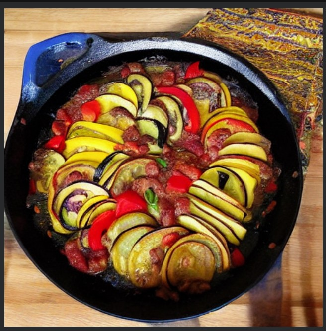
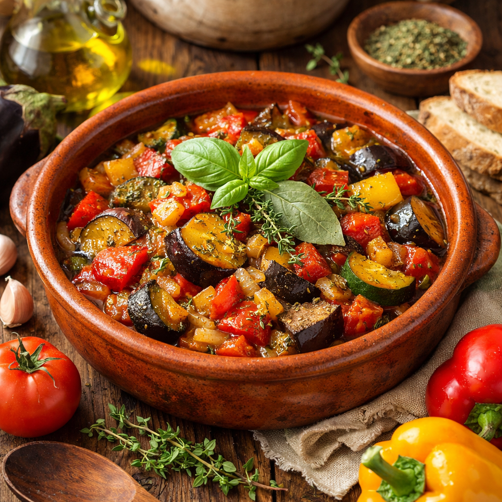

[{'Tasty Recipe 1': ['Ratatouille ( RAT-ə-TOO-ee, French: [ʁatatuj] ; Occitan: ratatolha [ʀataˈtuʎɔ] ) is a traditional French vegetable dish originating in the Provence region of southern France, particularly associated with Nice and its surrounding region. It developed within the context of rural Provençal cuisine, where seasonal vegetables were stewed together as a practical means of using surplus summer produce. The dish consists of a stew or sauté of seasonal summer vegetables cooked in olive oil and is sometimes referred to as ratatouille niçoise (French: [niswaz]).\nAlthough preparation methods and cooking times vary considerably by region and household, ratatouille is typically made with tomatoes, onions, garlic, courgettes (zucchini), aubergines (eggplants) and bell pepper, seasoned with herbs characteristic of Provençal cuisine. These may include fresh herbs such as basil,  marjoram or fennel, as well as dried herbs such as thyme, bay leaves, or blended herbs de Provence.\n\n\n== Etymology ==\nThe term ratatouille derives from the Occitan ratatolha and the related French verbs ratouiller and tatouiller, which are expressive forms of touiller, meaning "to stir" or "to toss".\nIn the early 19th century, the word was originally used to describe a coarse stew or mixed dish, sometimes with a pejorative connotation, rather than a specific vegetable preparation. Early printed references show that the term applied broadly to rustic mixtures, indicating that the name predates the standardized recipe known today.\n\n\n== History ==\n\nThe development of ratatouille in its modern form depended on the gradual incorporation of several vegetables introduced into European diets. Tomatoes, peppers, and squash were introduced to France after the 16th century following contact with the Americas during the New World, but were not widely accepted as food until the 18th and 19th centuries. Aubergine, introduced earlier through Mediterranean and Islamic culinary influence, became established in southern France before spreading to northward. Once these ingredients became commonplace in Provence, they were combined with olive oil, onions, garlic and local herbs into vegetable stews resembling modern ratatouille.\nAlthough vegetable stews had long been prepared in Provence, historical evidence suggests that no fully developed recipe identifiable as modern ratatouille appears in printed cookbooks before the late 19th or early 20th century. Earlier preparations varied considerably and did not consistently include the now-standard combination of aubergines, tomatoes, courgettes and peppers. The consolidation of these ingredients into a recognized dish appears to be a relatively recent culinary development, where a modern version does not appear in print until 1930.\nBy the early 20th century, ratatouille became increasingly associated with the cuisine of Nice. Regional cookery texts describe variations in preparation, including methods in which vegetables are cooked either together or sautéed separately before being combined. The inclusion of ratatouille in major culinary reference works during this period contributed to its codification as a distinct Provençal specialty, and facilitated its recognition beyond its regional origins.\nThe international recognition of ratatouille expanded significantly in the mid-20th century, particularly through the growing interest in Mediterranean cuisines outside France. Cookbooks aimed at English-speaking audiences presented ratatouille as emblematic of southern French cooking, emphasizing olive oil, ripe seasonal vegetables and simplicity of preparation. Through these publications, ratatouille transitioned from a regional peasant dish to a widely recognized component of French cuisine.\nFrom the late 20th century onward, professional chefs began reinterpreting ratatouille using refined techniques and modern presentation. One influential variation, known as Confit byaldi, arranged the vegetables in thin, carefully layered slices rather than preparing them as a stew, aligning the dish with contemporary haute cuisine aesthetics. While Confit Byaldi and similar interpretations influenced later fine-dining adaptations and popular representations, they differ substantially from the traditional rustic preparation associated with Provençal home cooking.\n\n\n== Preparation ==\nThe Guardian\'s food and drink writer Felicity Cloake wrote in 2016 that, considering ratatouille\'s relatively recent origins, there is a great variety of methods of preparing it. The Larousse Gastronomique says, "according to the purists, the different vegetables should be cooked separately, then combined and cooked slowly together until they attain a smooth, creamy consistency."\n\n\n== Gallery ==', '==== Dessert ====\nZabaione from Piedmont\nCrema pasticciera made with eggs and milk and common in the whole peninsula\n"Crema al mascarpone" used to make Tiramisù and to dress panettone at Christmas and common in the North of the country.\n\n\n=== Japanese ===\nSauces used in traditional Japanese cuisine are usually based on shōyu (soy sauce), miso or dashi. Ponzu, citrus-flavoured soy sauce, and yakitori no tare, sweetened rich soy sauce, are examples of shōyu-based sauces. Miso-based sauces include gomamiso, miso with ground sesame, and amamiso, sweetened miso. In modern Japanese cuisine, the word "sauce" often refers to Worcestershire sauce, introduced in the 19th century and modified to suit Japanese tastes. Tonkatsu, okonomiyaki, and yakisoba sauces are based on this sauce.\n\n\n=== Korean ===\nKorean cuisine uses sauces such as doenjang, gochujang, samjang, aekjeot, and soy sauce.\n\n\n=== Latin and Spanish American ===\nSalsas ("sauces" in Spanish) such as pico de gallo (tomato, onion and chili chopped with lemon juice), salsa cocida, salsa verde, chile, and salsa roja are an important part of many Latin and Spanish-American cuisines in the Americas. Typical ingredients include chili, tomato, onion, and spices; thicker sauces often contain avocado.\nMexican cuisine includes sauces which may contain chocolate, seeds, and chiles collectively known by the Nahua name mole (compare guacamole).\nIn Argentinian and Uruguayan cuisine, chimichurri is an uncooked sauce used in cooking and as a table condiment for grilled meat.\nPeruvian cuisine uses sauces based mostly in different varieties of ají combined with several ingredients, most notably salsa huancaína based on fresh cheese and salsa de ocopa based on peanuts or nuts.\n\n\n=== Middle Eastern ===\nFesenjān is a traditional Iranian sauce of pomegranates and walnuts served over meat and/or vegetables which was traditionally served for Yalda or end of winter and the Nowruz ceremony.\nHummus is a traditional middle eastern sauce or dip. It originated in Egypt, but is considered as a traditional food of many Arab countries such as Syria and Palestine. It is made of chickpeas and tahina (sesame paste) and garlic with olive oil, salt and lemon juice.\n\n\n=== Thai ===\nSoutheast Asian cuisines, such as Thai and Vietnamese cuisine, often use fish sauce, made from fermented fish.\n\n\n== Examples ==\n\n\n== See also ==\n\n\n== References ==\n\n\n=== Footnotes ===\n\n\n=== Citations ===\nDavidson, Alan; Jaine, Tom (2014). The Oxford Companion to Food (3rd ed.). New York: Oxford University Press. ISBN 978-0-19-175627-6.\nPeterson, James (2017). Sauces: Classical and Contemporary Sauce Making (4th ed.). Boston: Houghton Mifflin Harcourt. ISBN 978-0-544-81982-5.\nMcGee, Harold (2004). On Food and Cooking (2nd ed.). New York: Scribner. ISBN 1-4165-5637-0.\nWemischner, Robert (2015). "Sauce". In Goldstein, Darra (ed.). The Oxford Companion to Sugar and Sweets. Oxford University Press. ISBN 978-0-19-931339-6.\n\n\n== Further reading ==\nCorriher, Shirley (1997). "Ch. 4: sauce sense". Cookwise, the Hows and Whys of Successful Cooking (1st ed.). New York: William Morrow & Company, Inc. ISBN 0688102298.\nMcGee, Harold (1990). The Curious Cook. Macmillan. ISBN 0-86547-452-4.\nMurdoch (2004) Essential Seafood Cookbook Seafood sauces, p. 128–143. Murdoch Books. ISBN 9781740454124\nSokolov, Raymond (1976). The Saucier\'s Apprentice. Knopf. ISBN 0-394-48920-9.\n\n\n== External links ==\n\n"Sauce" entry at Encyclopædia Britannica']},                                            {'Tasty Recipe 2': ['Ratatouille ( RAT-ə-TOO-ee, French: [ʁatatuj] ; Occitan: ratatolha [ʀataˈtuʎɔ] ) is a traditional French vegetable dish originating in the Provence region of southern France, particularly associated with Nice and its surrounding region. It developed within the context of rural Provençal cuisine, where seasonal vegetables were stewed together as a practical means of using surplus summer produce. The dish consists of a stew or sauté of seasonal summer vegetables cooked in olive oil and is sometimes referred to as ratatouille niçoise (French: [niswaz]).\nAlthough preparation methods and cooking times vary considerably by region and household, ratatouille is typically made with tomatoes, onions, garlic, courgettes (zucchini), aubergines (eggplants) and bell pepper, seasoned with herbs characteristic of Provençal cuisine. These may include fresh herbs such as basil,  marjoram or fennel, as well as dried herbs such as thyme, bay leaves, or blended herbs de Provence.\n\n\n== Etymology ==\nThe term ratatouille derives from the Occitan ratatolha and the related French verbs ratouiller and tatouiller, which are expressive forms of touiller, meaning "to stir" or "to toss".\nIn the early 19th century, the word was originally used to describe a coarse stew or mixed dish, sometimes with a pejorative connotation, rather than a specific vegetable preparation. Early printed references show that the term applied broadly to rustic mixtures, indicating that the name predates the standardized recipe known today.\n\n\n== History ==\n\nThe development of ratatouille in its modern form depended on the gradual incorporation of several vegetables introduced into European diets. Tomatoes, peppers, and squash were introduced to France after the 16th century following contact with the Americas during the New World, but were not widely accepted as food until the 18th and 19th centuries. Aubergine, introduced earlier through Mediterranean and Islamic culinary influence, became established in southern France before spreading to northward. Once these ingredients became commonplace in Provence, they were combined with olive oil, onions, garlic and local herbs into vegetable stews resembling modern ratatouille.\nAlthough vegetable stews had long been prepared in Provence, historical evidence suggests that no fully developed recipe identifiable as modern ratatouille appears in printed cookbooks before the late 19th or early 20th century. Earlier preparations varied considerably and did not consistently include the now-standard combination of aubergines, tomatoes, courgettes and peppers. The consolidation of these ingredients into a recognized dish appears to be a relatively recent culinary development, where a modern version does not appear in print until 1930.\nBy the early 20th century, ratatouille became increasingly associated with the cuisine of Nice. Regional cookery texts describe variations in preparation, including methods in which vegetables are cooked either together or sautéed separately before being combined. The inclusion of ratatouille in major culinary reference works during this period contributed to its codification as a distinct Provençal specialty, and facilitated its recognition beyond its regional origins.\nThe international recognition of ratatouille expanded significantly in the mid-20th century, particularly through the growing interest in Mediterranean cuisines outside France. Cookbooks aimed at English-speaking audiences presented ratatouille as emblematic of southern French cooking, emphasizing olive oil, ripe seasonal vegetables and simplicity of preparation. Through these publications, ratatouille transitioned from a regional peasant dish to a widely recognized component of French cuisine.\nFrom the late 20th century onward, professional chefs began reinterpreting ratatouille using refined techniques and modern presentation. One influential variation, known as Confit byaldi, arranged the vegetables in thin, carefully layered slices rather than preparing them as a stew, aligning the dish with contemporary haute cuisine aesthetics. While Confit Byaldi and similar interpretations influenced later fine-dining adaptations and popular representations, they differ substantially from the traditional rustic preparation associated with Provençal home cooking.\n\n\n== Preparation ==\nThe Guardian\'s food and drink writer Felicity Cloake wrote in 2016 that, considering ratatouille\'s relatively recent origins, there is a great variety of methods of preparing it. The Larousse Gastronomique says, "according to the purists, the different vegetables should be cooked separately, then combined and cooked slowly together until they attain a smooth, creamy consistency."\n\n\n== Gallery ==', '==== Dessert ====\nZabaione from Piedmont\nCrema pasticciera made with eggs and milk and common in the whole peninsula\n"Crema al mascarpone" used to make Tiramisù and to dress panettone at Christmas and common in the North of the country.\n\n\n=== Japanese ===\nSauces used in traditional Japanese cuisine are usually based on shōyu (soy sauce), miso or dashi. Ponzu, citrus-flavoured soy sauce, and yakitori no tare, sweetened rich soy sauce, are examples of shōyu-based sauces. Miso-based sauces include gomamiso, miso with ground sesame, and amamiso, sweetened miso. In modern Japanese cuisine, the word "sauce" often refers to Worcestershire sauce, introduced in the 19th century and modified to suit Japanese tastes. Tonkatsu, okonomiyaki, and yakisoba sauces are based on this sauce.\n\n\n=== Korean ===\nKorean cuisine uses sauces such as doenjang, gochujang, samjang, aekjeot, and soy sauce.\n\n\n=== Latin and Spanish American ===\nSalsas ("sauces" in Spanish) such as pico de gallo (tomato, onion and chili chopped with lemon juice), salsa cocida, salsa verde, chile, and salsa roja are an important part of many Latin and Spanish-American cuisines in the Americas. Typical ingredients include chili, tomato, onion, and spices; thicker sauces often contain avocado.\nMexican cuisine includes sauces which may contain chocolate, seeds, and chiles collectively known by the Nahua name mole (compare guacamole).\nIn Argentinian and Uruguayan cuisine, chimichurri is an uncooked sauce used in cooking and as a table condiment for grilled meat.\nPeruvian cuisine uses sauces based mostly in different varieties of ají combined with several ingredients, most notably salsa huancaína based on fresh cheese and salsa de ocopa based on peanuts or nuts.\n\n\n=== Middle Eastern ===\nFesenjān is a traditional Iranian sauce of pomegranates and walnuts served over meat and/or vegetables which was traditionally served for Yalda or end of winter and the Nowruz ceremony.\nHummus is a traditional middle eastern sauce or dip. It originated in Egypt, but is considered as a traditional food of many Arab countries such as Syria and Palestine. It is made of chickpeas and tahina (sesame paste) and garlic with olive oil, salt and lemon juice.\n\n\n=== Thai ===\nSoutheast Asian cuisines, such as Thai and Vietnamese cuisine, often use fish sauce, made from fermented fish.\n\n\n== Examples ==\n\n\n== See also ==\n\n\n== References ==\n\n\n=== Footnotes ===\n\n\n=== Citations ===\nDavidson, Alan; Jaine, Tom (2014). The Oxford Companion to Food (3rd ed.). New York: Oxford University Press. ISBN 978-0-19-175627-6.\nPeterson, James (2017). Sauces: Classical and Contemporary Sauce Making (4th ed.). Boston: Houghton Mifflin Harcourt. ISBN 978-0-544-81982-5.\nMcGee, Harold (2004). On Food and Cooking (2nd ed.). New York: Scribner. ISBN 1-4165-5637-0.\nWemischner, Robert (2015). "Sauce". In Goldstein, Darra (ed.). The Oxford Companion to Sugar and Sweets. Oxford University Press. ISBN 978-0-19-931339-6.\n\n\n== Further reading ==\nCorriher, Shirley (1997). "Ch. 4: sauce sense". Cookwise, the Hows and Whys of Successful Cooking (1st ed.). New York: William Morrow & Company, Inc. ISBN 0688102298.\nMcGee, Harold (1990). The Curious Cook. Macmillan. ISBN 0-86547-452-4.\nMurdoch (2004) Essential Seafood Cookbook Seafood sauces, p. 128–143. Murdoch Books. ISBN 9781740454124\nSokolov, Raymond (1976). The Saucier\'s Apprentice. Knopf. ISBN 0-394-48920-9.\n\n\n== External links ==\n\n"Sauce" entry at Encyclopædia Britannica']}]
